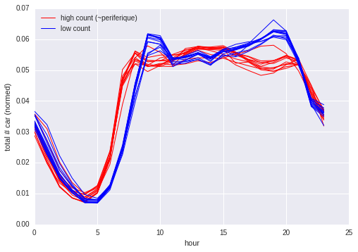
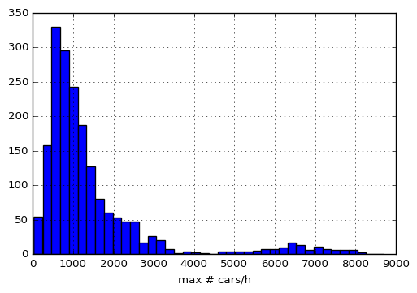
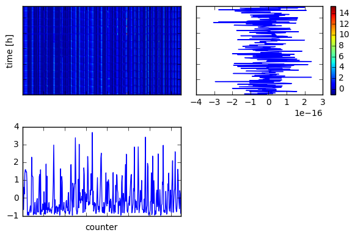
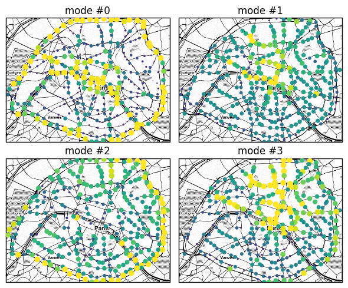
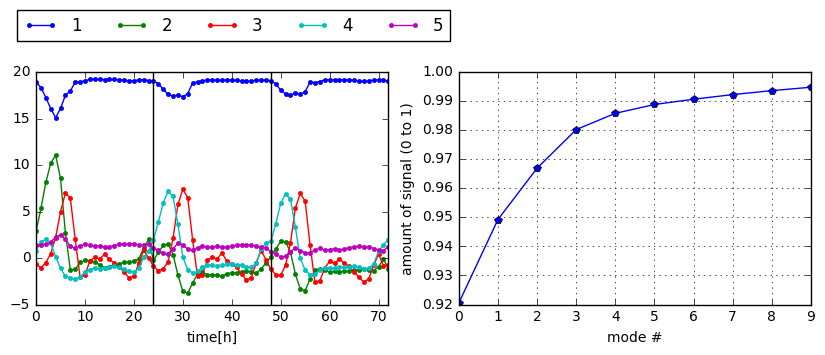

# Traffic in Paris
## or The heartbeat of Paris

Visualization of the traffic (`#cars/hour`) in Paris from data published by the [OpenData-Paris](https://opendata.paris.fr) project.
The data covers the period from the 21.01.2016  till 05.2017.

`Map: `[Stamen Toner](http://maps.stamen.com/toner/) -- `Data`: [comptages routiers permanents](https://opendata.paris.fr/explore/dataset/comptages-routiers-permanents/table/) -- `Code`: [traffic-movie.ipynb](https://nbviewer.jupyter.org/github/astyonax/heartbeat-traffic/blob/master/traffic-movie.ipynb) -- `Movie:` [link](movies/traffic_25.webm) -- `Interactive:` [link](https://nbviewer.jupyter.org/github/astyonax/heartbeat-traffic/blob/master/traffic-interactive.ipynb)

### The heartbeat depicted

We distinguish (statistically, see below) the periferique (essentially a 1D membrane) from the city (essentially a 2D cell :D).
In the figure below we plot how many cars are counted per hour and per month among all checkpoints (normed by the average over months). Each line is a month, and the numbers indicate the months from August (8) till December (12).

The two give similar pdf for the number of car passes, shifted by a lag of ~1h: the periferique wakes up earlier than the city?

The second figure is a plot of the relative variation of number of car counts. Again, each line corresponds to a different month, and numbers enumerate months from August to December. Are fluctuations repressed during peak hours because the network reaches maximum throughput?

### Illusions

You may think  the number of cars in the periferique to be bigger than that in the city. **Wrong**. We can't measure it, you can't too. By measuring  passages via the checkpoints (or measuring stations) with the time resolution of 1h[^] we can't measure  which cars are repeatedly counted during the same hour in different contiguous checkpoints.

[^] 1h is the minimum time scale reported in the raw data).

## How it is done

1. Downloaded the full csv (1.2Gb, 31e6 records)

1. We aggregated the data averaging over business days (Monday to Friday) [[code]](https://nbviewer.jupyter.org/github/astyonax/heartbeat-traffic/blob/master/raw%20csv%20to%20aggregates.ipynb).

2. Checkpoints with fixed counts among the dataset or 0/`nan` readings are removed (I guess that they are broken).
2. Paris is discretized on a coarse-graining grid of 25x25 cells. Per each measurement station inside a cell we sum the # of passages and  average the position [[code]](preprocess_aggregates.py)

3. To achieve a good visualization:
	1.  the maximum number of counted car passes per hour is capped at 15e3 per counter
	2. we compute intermediate points on a 100x100 grid with linear interpolation [[code]](https://nbviewer.jupyter.org/github/astyonax/heartbeat-traffic/blob/master/traffic-movie.ipynb). This yield the smoothly varying colormap.

The data files are not stored in this repo because they will get outdated in weeks. The final dataframe after pre-processing is about 60Mb, totally manageable.

## Daily traffic cycle
The code is [[here]](https://nbviewer.jupyter.org/github/astyonax/heartbeat-traffic/blob/master/traffic-cycles.ipynb).

We can easily distinguish checkpoints on the periferique by the others because those in the periferique are less, but with a high maximum rate of cars passing through:

Thus, we can plot the number of cars in the periferique versus those in the inner city each hour per month:

## Principal Components

`Map: `[Stamen Toner](http://maps.stamen.com/toner/) -- `Data`: [comptages routiers permanents](https://opendata.paris.fr/explore/dataset/comptages-routiers-permanents/table/) -- `Code`: [traffic-pca.ipynb](https://nbviewer.jupyter.org/github/astyonax/heartbeat-traffic/blob/master/traffic-pca.ipynb) -- `Movie:` [link](movies/pca.webm)

[Principal components analysis](http://sebastianraschka.com/Articles/2014_pca_step_by_step.html) allow to isolate the dominant behavior in a signal from the rest. It computes a set of empirical _eigenvectors_, directions along which the data is statistically uncorrelated. The associated _eigenvalues_ give a measure of the importance of the mode in the dataset. I chose to study the fluctuations of the counters with respect to the mean at each hour.
In this case the data is a 2D map C(i,t), where i is the i-th counter, and t the measurement time.
The dataset looks like

And the first 4 modes are

and the relative importance and time variation are

A more academic use of this technique is on the paper: _Human sperm steer with second harmonics of the flagellar beat_ ([arxiv](https://arxiv.org/abs/1703.07705),[!!](??))

So, we can now reconstruct the data, filtering the 0th mode, which brings in 92% of the signal but shadows other small yet correlated parts of the signal.
In the opening animation, on the left there is a reconstruction with all modes, on the right with all but the 0th; a red big dot  indicates more car than average, and a blue small dot indicate less cars than average.

Missing further data to validate possible models, I leave the interpretation to the reader ;)

## License
The movies, animation, plots, and texts (said the content) of this project are licensed under the [Creative Commons Attribution Share Alike 4.0](https://creativecommons.org/licenses/by-sa/4.0/) license, and the underlying source code used to analyze, format, render, and display that content is licensed under the [GNU GPLv3](http://www.gnu.org/licenses/gpl-3.0.txt) license.

----

Nothing of this would have been possible without:

python, numpy, pandas, sqlite, matplotlib, jupyter, bookeh, holoviews, conda, imagemagick, ffmpeg and the effort of those releasing and maintaining FOSS.
