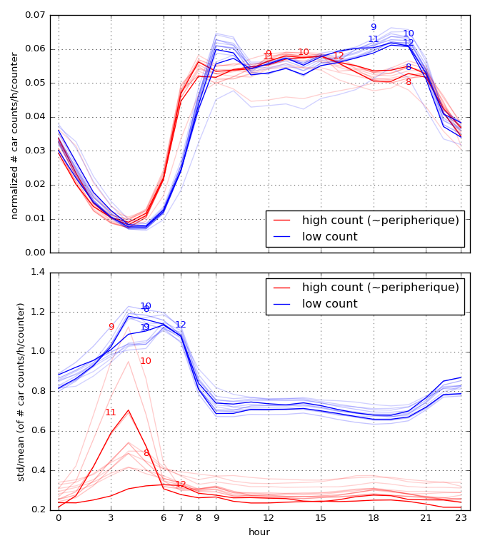

# Traffic in Paris
## or The heartbeat of Paris

Visualization of the traffic (`#cars/hour`) in Paris from data published by the [OpenData-Paris](https://opendata.paris.fr) project.
The data covers the period from the 21.01.2016  till 05.2017.

https://nbviewer.jupyter.org/github/astyonax/heartbeat-traffic/blob/master/traffic-interactive.ipynb

*`Map: `[Stamen Toner](http://maps.stamen.com/toner/) -- `Data`: [comptages routiers permanents](https://opendata.paris.fr/explore/dataset/comptages-routiers-permanents/table/) -- `Code`: [traffic-movie.ipynb](https://nbviewer.jupyter.org/github/astyonax/heartbeat-traffic/blob/master/traffic-movie.ipynb) -- `Movie:` [link](traffic_25.webm) -- `Interactive:` [link](https://nbviewer.jupyter.org/github/astyonax/heartbeat-traffic/blob/master/traffic-interactive.ipynb)

### The heartbeat depicted
We distinguish (statistically, see below) the periferique (essentially a 1D membrane) from the city (essentially a 2D cell :D). 
The two give similar pdf for the number of car passes, shifted by a lag of ~1h: the periferique wakes up earlier than the city?

 

### Illusions

You may think  the number of cars in the periferique to be bigger than that in the city. **Wrong**. We can measure it, you can't too. By measuring  passages via the checkpoints (or measuring stations) with the time resolution of 1h[^] we can't measure  which cars are repeatedly counted during the same hour in different contiguous checkpoints. 

[^] 1h is the minimum time scale reported in the raw data).

## How it is done

1. Downloaded the full csv (1.2Gb, 31e6 records)

1. We aggregated the data averaging over business days (Monday to Friday) [[code]](https://nbviewer.jupyter.org/github/astyonax/heartbeat-traffic/blob/master/raw%20csv%20to%20aggregates.ipynb).

2. Checkpoints with fixed counts among the dataset or 0/`nan` readings are removed (I guess that they are broken).
2. Paris is discretized on a coarse-graining grid of 25x25 cells. Per each measurement station inside a cell we summed the # of passages and the average position [[code]](preprocess_aggregates.py)

3. To achieve a good visualization:
	1.  the maximum number of counted car passes per hour is capped at 15e3 per counter
	2. we compute intermediate points on a 100x100 grid with linear interpolation [[code]](https://nbviewer.jupyter.org/github/astyonax/heartbeat-traffic/blob/master/traffic-movie.ipynb). This yield the smoothly varying colormap.
	 
The data files are not stored in this repo because they will get outdated in weeks. The final dataframe after pre-processing is about 60Mb, totally manageable.

## Daily traffic cycle
The code is [[here]](https://nbviewer.jupyter.org/github/astyonax/heartbeat-traffic/blob/master/traffic-cycles.ipynb).

We can easily distinguish checkpoints on the periferique by the others because those in the periferique are less, but with a high maximum rate of cars passing through:

 

Thus, we can plot the number of cars in the periferique versus those in the inner city each hour per month:

 

## License
The movies, animation, plots, and texts (said the content) of this project are licensed under the [Creative Commons Attribution Share Alike 4.0](https://creativecommons.org/licenses/by-sa/4.0/) license, and the underlying source code used to analyze, format, render, and display that content is licensed under the [GNU GPLv3](http://www.gnu.org/licenses/gpl-3.0.txt) license.

----

Nothing of this would have been possible without: 

python, numpy, pandas, sqlite, matplotlib, jupyter, bookeh, holoviews, conda, imagemagick, ffmpeg and the effort of those releasing and maintaining FOSS.

